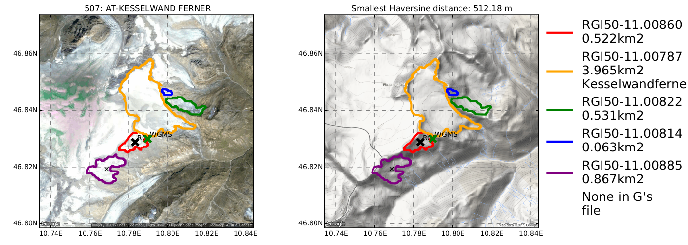

Linking glaciological databases
===============================

Motivation
----------
The recent development of open access glaciological databases (glacier outlines, mass-balance, thickness...) allows important advances in the field of global scale glaciology. However, employing data from different sources can be challenging as the various datasets have different histories and standards. In the case of glacier inventories, for example, glacier coordinates might be outdated or have rounding errors and linking the databases becomes impossible without expert knowledge. Here, we implement a semi-automated tool to link the Randolph Glacier Inventory (`RGI 5.0 <http://www.glims.org/RGI/rgi50_dl.html>`__), the World Glacier Monitoring Service Fluctuation of Glaciers dataset (`WGMS FoG 2014 <http://wgms.ch/downloads/DOI-WGMS-FoG-2015-11.zip>`__), Glacier Thickness Dataset (`GlaThiDa 2014 <http://www.gtn-g.ch/data_catalogue_glathida/>`__) and glacier length fluctuations compiled by `P. Leclercq <http://folk.uio.no/paulwl/length.php>`__. As we have to cross-check all automatic linkings manually, we restrict to glaciers with more than **five mass balance measurements** in the WGMS FoG dataset. Still, this comprises 259 world glaciers in total.

We provide all our results on this page! Feel free to download them, bring up your own ideas to improve the method or contact us.

|

Example
-------

Sometimes, the following happens:

The image shows a linking of WGMS to RGI. Unfortunately, the WGMS point lies outside the orange RGI glacier outline of Kesselwandferner so that an automatic linking based on spatial relations is not possible. The closest RGI polygon found is the red neighbor glacier, which is obviously the wrong one.

The good thing is: Kesselwandferner is a "famous" glacier and thus has a name attribute in RGI. This makes the correction a lot easier.

Method
------

Our linking approach based on the WGMS inventory includes mainly the following steps:

1. Selection of all glaciers with more than 5 mass balance measurements. This is necessary in order to keep the number of glaciers to check manageable.

2. Calculating the `Haversine distance <https://en.wikipedia.org/wiki/Haversine_formula>`_ of all glaciers in RGI, GlaThiDa and Leclercq's collection to each respective WGMS point

3. Take the five closest RGI polygons and their exterior coordinates to set up a map supported by Google Maps terrain and visual base images

4. Check whether or not GlaThiDa and Leclercq points are on the grid - not every WGMS glacier has a GlaThiDa/Leclercq equivalent

5. Wherever possible, add some extra info obtained through a manual linking file compiled by Graham Cogley

About
-----

:Status:
    Experimental - in development
    
:License:
    GNU GPLv3

:Authors:
    - Johannes Landmann
    - Fabien Maussion 

:Funding:
    Austrian Research Foundation FWF, Projects P22443-N21 and P25362-N26

    .. image:: http://acinn.uibk.ac.at/sites/all/themes/imgi/images/acinn_logo.png
    
    .. image:: http://www.uni-bremen.de/fileadmin/images/logo-uni-bremen-EXZELLENT.png
        :align: right
