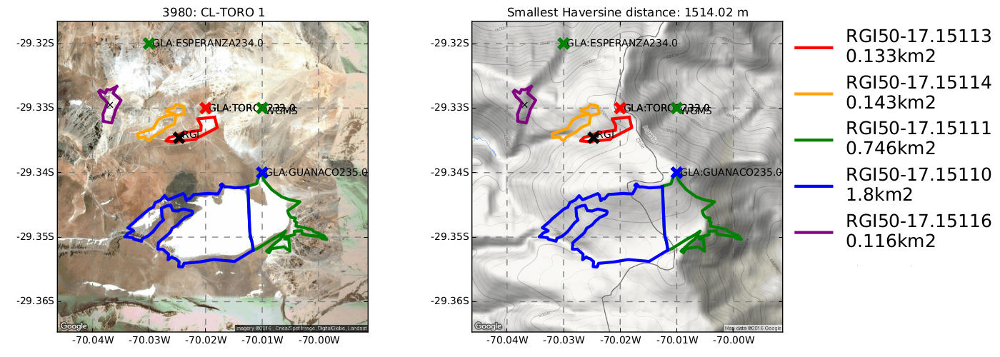

Linking glaciological databases
===============================

Motivation
----------
The recent development of open access glaciological databases (glacier outlines, mass-balance, thickness...) allows important advances in the field of global scale glaciology. However, employing data from different sources can be challenging as the various datasets have different histories and standards. In the case of glacier inventories, for example, glacier coordinates might be outdated or have rounding errors and linking the databases becomes impossible without expert knowledge. Here, we implement a semi-automated tool to link the Randolph Glacier Inventory (`RGI 5.0 <http://www.glims.org/RGI/rgi50_dl.html>`__), the World Glacier Monitoring Service Fluctuation of Glaciers dataset (`WGMS FoG 2014 <http://wgms.ch/data_databaseversions/>`__), Glacier Thickness Dataset (`GlaThiDa 2014 <http://www.gtn-g.ch/data_catalogue_glathida/>`__) and glacier length fluctuations compiled by `P. Leclercq <http://folk.uio.no/paulwl/length.php>`__. As we have to cross-check all automatic linkings manually, we restrict to glaciers with more than **five mass balance measurements** in the WGMS FoG dataset. Still, this comprises 259 world glaciers in total.

We provide all our results on this page! Feel free to download them, bring up your own ideas to improve the method or contact us.

|

Example
-------

Sometimes, the following happens:

The image shows a linking of WGMS to RGI, GlaThiDa and Leclercq. The object we're looking for is WGMS glacier "Toro 1" in Chile, WGMS ID 3980 (see title of left plot). Unfortunately, the coordinates of the green WGMS point are rounded and lie outside the red RGI outline of the glacier. Accordingly, an automated linking is not possible. The red GlaThiDa cross (ID:232) belongs to Toro 2 (hardly visible for graphical reasons), which is the orange RGI outline. Visually, however, it is closer to Toro 1. Leclercq entries on the plot area do not exist, otherwise they would be visible.

However, from this plot it cannot be concluded that there is in fact no Leclercq entry for one of the glaciers. For example GlaThiDa 234 for glacier Esperanza is quite far away from the violet glacier outline. Assuming that the Leclercq point for Esperanza was situated at the same distance to the glacier, but in a western direction, it was not detectable on the plot (boundaries are determined by the five closest RGI polygons around the WGMS point plus some buffer). It follows that all links have to be checked also in "the other direction", i.e. with another inventory as starting point.

Method
------

Our linking approach includes mainly the following steps:

1. Pre-selection in order to keep the number of glaciers to check manageable. WGMS: All glaciers with more than 5 MB measurements in the Alps and worldwide. No pre-selection of GlaThiDa and Leclercq in the Alps.

2. Calculation of the `Haversine distance <https://en.wikipedia.org/wiki/Haversine_formula>`_ of each glacier in the starting inventory to all glaciers in the target inventories

3. Taking the five closest RGI polygons and their exterior coordinates to set up a map supported by Google Maps terrain and visual satellite base images

4. Checking whether or not glacier points from the inventories to be linked are on the grid - not every  glacier in the starting inventory has an equivalent in the target inventories

5. Creating a CSV file with all selected glaciers from the starting inventory linked to the closest entries in the target inventories

6. Manually checking the automated links with the help of internet images, research papers, etc.

7. Using all target inventories as starting inventories while employing the "safe" links that have already been established

About
-----

:Status:
    Experimental - in development
    
:License:
    GNU GPLv3

:Authors:
    - Johannes Landmann
    - Fabien Maussion 

:Funding:
    Austrian Research Foundation FWF, Projects P22443-N21 and P25362-N26

    .. image:: http://acinn.uibk.ac.at/sites/all/themes/imgi/images/acinn_logo.png
    
    .. image:: http://www.uni-bremen.de/fileadmin/images/logo-uni-bremen-EXZELLENT.png
        :align: right
